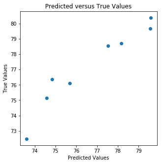
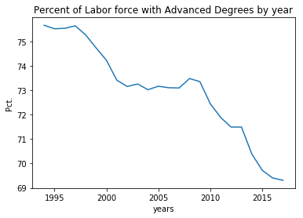
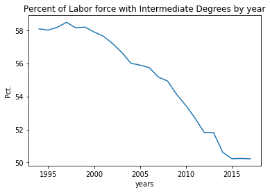
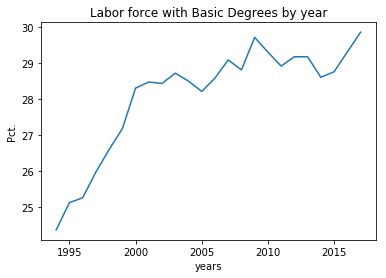

# Prediciting Employment 

## Questions

1.	How does labor force education impacted employment and unemployment in agriculture, industry and services           sectors of the economy in the USA? 
2.	Has there been an increase in the percentage of the labor force with advanced education and has this lead to        more workers in the service sector of the economy of the USA?

## Data

    The data comes from the World Data Indicators dataset. The following indicators will be used:
     
    Employment in agriculture (% of total employment) (modeled ILO estimate)
    Employment in industry (% of total employment) (modeled ILO estimate)
    Employment in services (% of total employment) (modeled ILO estimate)
    Labor force with advanced education (% of total working-age population with advanced education)
    Labor force with basic education (% of total working-age population with basic education)
    Labor force with intermediate education (% of total working-age population with intermediate education)
    Unemployment with advanced education (% of total labor force with advanced education)
    Unemployment with basic education (% of total labor force with basic education)
    Unemployment with intermediate education (% of total labor force with intermediate education)
    Unemployment, total (% of total labor force) (modeled ILO estimate)
    Unemployment, total (% of total labor force) (national estimate)

    This will include the years from 1994 to 2017. 

    Basic Education is through 8th grade
    Intermediate Education is through high school
    Advanced Education is a college degree or more (Masters, PhD.)

## Data Analysis and Cleansing

    There was no missing data in the dataset. The data was standardized using Sklearn Standard Scaler.

## Model
    
    Linear regression will be used to determine if there is any relationship between 
    employment in the 3 economic sectors and educational attainment by the labor force.

## Model Interupation

### Predict Employment in Service Industry

    OLS Regression Results

    Dep. Variable:      employed_services 
    Model:                            OLS
    Method:                 Least Squares 
    R-squared:                       0.972
    Adj. R-squared:                  0.966
    Prob (F-statistic):           1.28e-09
  
                     coef    std err          t      P>|t|      [0.025      0.975]
    
    ------------------------------------------------------------------------------
    const         77.4042      0.114    676.180      0.000      77.155      77.654
    x1             1.7937      0.237      7.579      0.000       1.278       2.309
    x2            -2.3455      0.428     -5.475      0.000      -3.279      -1.412
    x3             1.6119      0.533      3.023      0.011       0.450       2.774
    

x1 - total_labor_force_basic_ed 
x2 - total_labor_force_intermediate_ed 
x3 - total_labor_force_advanced_ed 

The model has a really high Adjusted R-squared which would indicate the model is doing a good job of predicting. However, since the dataset is small it is possible that the test data was not evenly distributed. A next step in the model analysis would be to hold back some real data from the model and then compare the predictions to the held back data.

   

## Surprising find in the data

I was surprised to see the percentage of the workforce with a high school or college degree was dropping while the percentage of people with a basic education was rising.

